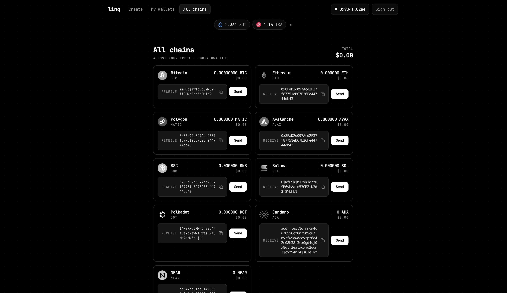

# dWallet — zkLogin multi-chain wallets on Sui

> Built for **linq**.

Sign in with **Google** (zkLogin — no wallet extension, no seed phrase), get a **Sui address**, and
create **dWallets** secured by the **Ika 2PC-MPC** network. Each account creates **one ECDSA** and
**one EdDSA** dWallet; together they derive addresses, show balances, and **send + receive** across
**9 chains** — Ethereum, Polygon, Avalanche, BSC, Bitcoin, Solana, Polkadot, Cardano, NEAR.

Clean, black-and-white, JetBrains-Mono UI. Next.js 16 (App Router) + React 19.



---

## Table of contents

- [How it works](#how-it-works)
- [Project structure](#project-structure)
- [Prerequisites](#prerequisites)
- [Setup](#setup)
- [Running](#running)
- [The flows in detail](#the-flows-in-detail)
- [Security notes](#security-notes)
- [Known limitations](#known-limitations)
- [Extending it](#extending-it)
- [Scripts & stack](#scripts--stack)

---

## How it works

Two key systems combine:

**1. Auth = zkLogin (Google + Shinami).** Sign-in derives the user's Sui address from their Google
account. An **ephemeral keypair is generated in the browser and never leaves it** — it signs
transaction bytes; the server only ever sees the ephemeral *public* key and the resulting signature.
The Google `id_token` (JWT), the salt, and the address live server-side in an encrypted **httpOnly
cookie**. The Groth16 zkLogin proof is minted by **Shinami** and assembled with the user's signature
on the server. See `lib/zklogin/*` + `app/api/zklogin/*`.

**2. dWallets = Ika 2PC-MPC.** A dWallet's key is split across the Ika validator network — no single
party (including the user) ever holds it whole. Creating one runs a two-transaction DKG; signing a
target-chain transaction runs a presign + sign. **Both of those Sui transactions are signed via
zkLogin** (`lib/zklogin/execute.ts::zkLoginSignAndExecute`), so the same Google identity that owns
the account authorizes every dWallet operation.

```
Google ──id_token──▶ Shinami (salt + address + Groth16 proof)
   │                                   │
   ▼                                   ▼
Browser: ephemeral key  ──signs Sui tx bytes──▶  /api/zklogin/execute
   │                                   (proof + sig → zkLoginSignature → submit)
   ▼
Ika SDK builds DKG / presign / sign Sui transactions  ──▶  Sui  ──▶  Ika MPC network
   │
   ▼
dWallet (ECDSA → BTC + EVM · EdDSA → SOL/DOT/ADA/NEAR)  ──send/receive──▶ target chains
```

### Curve → chains (a dWallet only covers its own curve)

| dWallet | Curve | Chains |
|---|---|---|
| **ECDSA** | secp256k1 | Bitcoin, Ethereum, Polygon, Avalanche, BSC (the 4 EVM chains share one `0x` address) |
| **EdDSA** | ed25519 | Solana, Polkadot, Cardano, NEAR |

One ECDSA + one EdDSA → all 9 chains, aggregated in the **All chains** view.

---

## Project structure

```
app/
  layout.tsx · providers.tsx · page.tsx · globals.css   UI shell + the single-page app
  api/
    zklogin/{epoch,login,callback,me,logout,execute}/   zkLogin auth + signing (server, Node runtime)
    prices/                                              CoinGecko price+logo proxy
    bitcoin-balance/ · cardano-*/                        CORS proxies for chains that block the browser
components/
  ConnectWallet.tsx   Sign in with Google / profile / sign out
  GasBalances.tsx     top strip: the zkLogin address's SUI + IKA balances
  SendModal.tsx       per-chain send dialog (drives the MPC pipeline via zkLogin)
lib/
  zklogin/
    zklogin.ts   ephemeral keys, nonce, address seed, signature assembly (browser + server)
    google.ts    Google OIDC: auth URL, code→id_token, JWKS verify           (server)
    shinami.ts   Shinami: getZkLoginWallet + createZkLoginProof              (server)
    session.ts   AES-256-GCM httpOnly session cookie (jwt + salt + address)  (server)
    execute.ts   sign a client-built Sui tx with the ephemeral key → /execute (browser)
  useZkLogin.ts  client hook: user, signIn, signOut
  ika/
    createDWallet.ts  full DKG → Active in two signatures
    listDWallets.ts   read the account's dWallets from Sui (newest-first)
    walletDetail.ts   derive a dWallet's public key + per-chain addresses
  dwallet/
    clientSideSigning.ts  MPC orchestration: build → presign → sign → broadcast (+ presign-ahead)
    core/                 shared types, deterministic encryption seed, cached IkaClient
    chains/               per-chain tx build + broadcast (ethereum, bitcoin, solana, …)
  utils/
    deriveAddresses.ts  public key → per-chain address (shared by detail + balances)
    fetchBalances.ts    per-chain RPC balances + USD value (two-phase, non-blocking)
    prices.ts           CoinGecko price + logo client helper
  config/chains.ts      testnet RPCs, chain ids, native currencies
  providers/SuiWalletProvider.tsx   SuiClientProvider (reads/build only — no browser wallet)
```

---

## Prerequisites

- **Node 20+** (developed on 24) and **pnpm 10+**
- A **Google Cloud** project with an OAuth "Web application" client
- A **Shinami** account/API key with **zkLogin Wallet + zkProver** enabled
- Testnet **SUI** (gas) and **IKA** (MPC fees) in your zkLogin address, plus the target chain's
  native gas for sends. Faucets: <https://faucet.sui.io> · <https://faucet.ika.xyz>

---

## Setup

```bash
pnpm install
cp .env.example .env.local   # then fill it in (see below)
```

`.env.local` (all required except the last):

| Var | What | Where |
|---|---|---|
| `GOOGLE_CLIENT_ID` / `GOOGLE_CLIENT_SECRET` | OAuth web client | console.cloud.google.com/apis/credentials |
| `GOOGLE_REDIRECT_URI` | `http://localhost:3002/api/zklogin/callback` | must match the Google console **and** the port |
| `SHINAMI_API_KEY` | zkLogin wallet + prover (one key) | app.shinami.com |
| `SESSION_SECRET` | cookie encryption, 32+ random chars (`openssl rand -base64 48`) | — |
| `NEXT_PUBLIC_SUI_NETWORK` | `testnet` | — |
| `NEXT_PUBLIC_IKA_PACKAGE_ID` | Ika package (optional; a fallback exists in code) | — |

In **Google Cloud → Credentials**, add `http://localhost:3002/api/zklogin/callback` as an authorized
redirect URI (it must equal `GOOGLE_REDIRECT_URI`). Change the port? Update both.

> Secrets (`SHINAMI_API_KEY`, `GOOGLE_CLIENT_SECRET`, `SESSION_SECRET`) are **server-only** and never
> shipped to the browser. `.env*` is git-ignored — never commit `.env.local`.

---

## Running

```bash
pnpm dev      # http://localhost:3002
pnpm build    # production build
pnpm start    # serve the production build (port 3002)
pnpm lint     # eslint
```

Then: **Sign in with Google** → copy your Sui address from the top bar → fund it with testnet SUI +
IKA → **Create** your ECDSA and EdDSA dWallets → open one (or **All chains**) to receive and send.

---

## The flows in detail

**Sign in** — `useZkLogin().signIn()` fetches the current epoch, creates an ephemeral session
(`createEphemeralSession`), stores it in `sessionStorage`, and redirects to Google with the nonce.
Google returns to `/api/zklogin/callback`, which verifies the id_token, gets the address+salt from
Shinami, and seals the session cookie.

**Create a dWallet** (`lib/ika/createDWallet.ts`) — two signatures:
1. `prepareDKGAsync` → `registerEncryptionKey` (if needed) + `requestDWalletDKG` *(sign #1)*.
2. wait for `AwaitingKeyHolderSignature` → `acceptEncryptedUserShare` with the **original**
   `userPublicOutput` *(sign #2)* → wait for `Active`. The output is reused verbatim (the SDK
   verifies it cryptographically; regenerating it fails) — never regenerated.

The Create tab enforces **one ECDSA + one EdDSA** per account (checks existing dWallets first).

**Receive** — every chain row shows its derived address; click to copy. No signing.

**Send** (`components/SendModal.tsx` → `lib/dwallet/clientSideSigning.ts`) — builds the target-chain
tx, runs presign + sign (two Sui transactions, each signed via zkLogin), then broadcasts. The first
send mints a Shinami proof (~2–4s); it's cached per ephemeral session in `/api/zklogin/execute`, so
later sends only re-sign (sub-second proof step).

---

## Security notes

- **Ephemeral private key never leaves the browser.** The server sees only the public key + the
  signature. A stolen proof is useless without the key; a stolen key expires at `maxEpoch`.
- **Session cookie** is AES-256-GCM, `httpOnly`, `sameSite=lax`, `Secure` in production. The JWT and
  salt are never exposed to the client (`/api/zklogin/me` returns address/profile only).
- **CSRF** on the OAuth round-trip via a `state` cookie checked in the callback.
- **`/api/zklogin/execute` is generic** — it signs and submits whatever transaction bytes the
  signed-in user hands it. That's intentional (the user authorizes each tx with their ephemeral
  signature), but if you add privileged server actions, scope/validate the bytes accordingly.
- **No private keys server-side.** Sui signing is zkLogin; the dWallet key is MPC-split.

---

## Known limitations

- **Shinami prover is primarily mainnet.** On testnet it usually works; if proof minting errors,
  switch `lib/zklogin/shinami.ts` to Mysten's testnet dev prover. (Mysten's mainnet prover whitelists
  OAuth audiences, which is why Shinami is used here.)
- **Bitcoin** address derivation uses Node `crypto` (browser-compatibility risk; falls back to
  `Invalid public key` if unavailable). EVM + Solana are the most robust paths.
- **Polkadot** balance uses `@polkadot/api` over a public Paseo WebSocket — slow/flaky; returns 0 on
  failure (the UI no longer blocks on it). A dedicated RPC or an HTTP query would be more reliable.
- **Proof cache is in-memory** (per server instance) — ideal in dev / a warm instance; on scaled
  serverless, back it with Redis/KV keyed by `ephemeralPubKey:maxEpoch:salt`.
- **Balances** load in a second pass (rows render immediately, balances fill in); a dead RPC just
  shows `0`.
- **Ported signing code** (`lib/dwallet/chains/*`, `deriveAddresses.ts`) is verbose and uses
  `require()`/`any` (pre-existing eslint warnings) — it's battle-tested; refactor cautiously.
- **Networks are testnets**; token prices/logos are mainnet market values shown against testnet
  balances (standard wallet display).

---

## Extending it

- **Add a chain** — implement `ChainSigner` (`buildUnsignedTransaction` + `broadcastTransaction`) in
  `lib/dwallet/chains/`, register it in `chains/index.ts`, add derivation in
  `lib/utils/deriveAddresses.ts`, a balance fetcher in `fetchBalances.ts`, and a CoinGecko id in
  `lib/utils/prices.ts`.
- **Swap the OIDC provider** (Apple, etc.) — replace `lib/zklogin/google.ts`; the rest is identical
  as long as you get a signed `id_token` carrying the nonce.
- **Production hardening** — Redis-backed proof + session store, a gas station for gasless UX, rate
  limiting on `/api/zklogin/*`, and a real RPC plan (the public testnet RPCs are best-effort).

---

## Scripts & stack

**Stack:** Next.js 16 (App Router), React 19, TypeScript, Tailwind v4, JetBrains Mono, `@ika.xyz/sdk`
(+ `ika-wasm`), `@mysten/sui`, `jose` (JWT verify), `ethers`, `@solana/web3.js`, `@polkadot/api`,
`@emurgo/cardano-serialization-lib-browser`, `near-api-js`.

Reference: <https://docs.sui.io/concepts/cryptography/zklogin> ·
<https://docs.shinami.com/api-docs/sui/wallet-services/zklogin-wallet-api> · <https://docs.ika.xyz>
