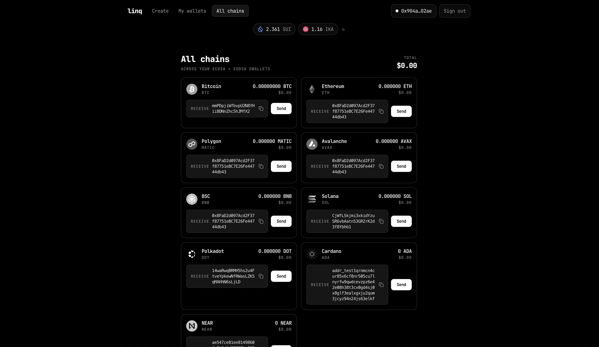

# ycos — your chain on sui

> Built for **linq**.

Sign in with **Google** (zkLogin — no wallet extension, no seed phrase), get a **Sui mainnet
address**, and create **dWallets** secured by the **Ika 2PC-MPC v4** network.

One setup transaction generates a dWallet on each of the three curves Ika supports — **secp256k1**,
**ed25519** and **ristretto** — and together they derive real addresses on **14 chains**, every one of
which can both **send and receive**:

| Curve | Chains |
| --- | --- |
| secp256k1 | Bitcoin (Taproot), Ethereum, Base, Arbitrum, Optimism, Polygon, Avalanche, BSC, Linea, Scroll |
| ed25519 | Solana, NEAR, Cardano |
| ristretto | Polkadot |

Sui is the coordination layer: it holds the keys and settles state. Everything runs on **mainnet** —
Sui mainnet, the Ika mainnet 2PC-MPC coordinator, and mainnet destination chains.

> [!WARNING]
> **This is mainnet.** Every dWallet controls real assets and every send moves real value.
> Transactions are irreversible. There are no faucets — SUI (gas) and IKA (2PC-MPC session fees)
> must be acquired.

Clean, black-and-white, JetBrains-Mono UI. Next.js 16 (App Router) + React 19.



---

## Table of contents

- [How it works](#how-it-works)
- [Project structure](#project-structure)
- [Prerequisites](#prerequisites)
- [Setup](#setup)
- [Running](#running)
- [The flows in detail](#the-flows-in-detail)
- [Security notes](#security-notes)
- [Known limitations](#known-limitations)
- [Extending it](#extending-it)
- [Scripts & stack](#scripts--stack)

---

## How it works

Two key systems combine:

**1. Auth = zkLogin (Google + Shinami).** Sign-in derives the user's Sui address from their Google
account. An **ephemeral keypair is generated in the browser and never leaves it** — it signs
transaction bytes; the server only ever sees the ephemeral *public* key and the resulting signature.
The Google `id_token` (JWT), the salt, and the address live server-side in an encrypted **httpOnly
cookie**. The Groth16 zkLogin proof is minted by **Shinami** and assembled with the user's signature
on the server. See `lib/zklogin/*` + `app/api/zklogin/*`.

**2. dWallets = Ika 2PC-MPC v4.** A dWallet's key is split across the Ika validator network — no
single party (including the user) ever holds it whole. Creating one runs a two-transaction DKG;
signing a target-chain transaction runs a presign + sign. **Both of those Sui transactions are signed
via zkLogin** (`lib/zklogin/execute.ts::zkLoginSignAndExecute`), so the same Google identity that owns
the account authorizes every dWallet operation.

**What v4 changes: the presignature pool.** An MPC signature has offline rounds (presignature) and
online rounds (signature). Presignatures are message-independent, so they can be computed before
anyone knows what will be signed. v4 ("fast Schnorr") makes them **client-independent** — and thus
public-key-independent — for **ECDSA as well as Schnorr/EdDSA** (Schnorr has had this since v3). A
client-independent presignature is valid for *any* dWallet and *any* message, so the network
precomputes them continuously in the background and banks them in a pool instead of sitting idle.
A signer buys one from the pool and performs a **single online round (~400ms)** rather than waiting
out the offline phase — which is what removes the latency and lets the network absorb demand spikes.

On-chain this is `requestGlobalPresign` (*global* = not bound to one dWallet). Which curve/algorithm
pairs are pool-served is published by the coordinator as a `GlobalPresignConfig`, and for the pairs it
lists, pooled presign is **mandatory** — the per-dWallet `requestPresign` aborts with
`EOnlyGlobalPresignAllowed`. `lib/ika/globalPresign.ts` reads that policy live and routes accordingly
rather than hardcoding it. As currently deployed, every pair this app uses is pool-served:

| Curve | Signature algorithm | Chains |
|---|---|---|
| secp256k1 | ECDSASecp256k1 | Ethereum, Polygon, Avalanche, BSC, Bitcoin |
| secp256k1 | Taproot | Bitcoin Taproot |
| ed25519 | EdDSA | Solana, NEAR, Cardano |
| ristretto | SchnorrkelSubstrate | Polkadot (Schnorrkel) |

Note the deprecated `support_config.signature_algorithms_allowed_global_presign` vector is **empty**
on mainnet — reading that field instead of `GlobalPresignConfig` is the trap, since it makes the
network look like it has no global-presign support at all.

```
Google ──id_token──▶ Shinami (salt + address + Groth16 proof)
   │                                   │
   ▼                                   ▼
Browser: ephemeral key  ──signs Sui tx bytes──▶  /api/zklogin/execute
   │                                   (proof + sig → zkLoginSignature → submit)
   ▼
Ika SDK builds DKG / presign / sign Sui transactions  ──▶  Sui  ──▶  Ika MPC network
   │
   ▼
dWallet (ECDSA → BTC + EVM · EdDSA → SOL/DOT/ADA/NEAR)  ──send/receive──▶ target chains
```

### Curve → chains (a dWallet only covers its own curve)

| dWallet | Curve | Chains |
|---|---|---|
| **ECDSA** | secp256k1 | Ethereum, Polygon, Avalanche, BSC (the 4 EVM chains share one `0x` address) + **Bitcoin via Taproot** |
| **EdDSA** | ed25519 | Solana, Polkadot, Cardano, NEAR |

One ECDSA + one EdDSA → all 9 chains, aggregated in the **All chains** view.

---

## Project structure

```
app/
  layout.tsx · providers.tsx · page.tsx · globals.css   UI shell + the single-page app
  api/
    zklogin/{epoch,login,callback,me,logout,execute}/   zkLogin auth + signing (server, Node runtime)
    prices/                                              CoinGecko price+logo proxy
    bitcoin-balance/ · cardano-*/                        CORS proxies for chains that block the browser
components/
  ConnectWallet.tsx   Sign in with Google / profile / sign out
  GasBalances.tsx     top strip: the zkLogin address's SUI + IKA balances
  SendModal.tsx       per-chain send dialog (drives the MPC pipeline via zkLogin)
lib/
  zklogin/
    zklogin.ts   ephemeral keys, nonce, address seed, signature assembly (browser + server)
    google.ts    Google OIDC: auth URL, code→id_token, JWKS verify           (server)
    shinami.ts   Shinami: getZkLoginWallet + createZkLoginProof              (server)
    session.ts   AES-256-GCM httpOnly session cookie (jwt + salt + address)  (server)
    execute.ts   sign a client-built Sui tx with the ephemeral key → /execute (browser)
  useZkLogin.ts  client hook: user, signIn, signOut
  ika/
    createDWallet.ts  full DKG → Active in two signatures
    listDWallets.ts   read the account's dWallets from Sui (newest-first)
    walletDetail.ts   derive a dWallet's public key + per-chain addresses
  dwallet/
    clientSideSigning.ts  MPC orchestration: build → presign → sign → broadcast (+ presign-ahead)
    core/                 shared types, deterministic encryption seed, cached IkaClient
    chains/               per-chain tx build + broadcast (ethereum, bitcoin, solana, …)
  utils/
    deriveAddresses.ts  public key → per-chain address (shared by detail + balances)
    fetchBalances.ts    per-chain RPC balances + USD value (two-phase, non-blocking)
    prices.ts           CoinGecko price + logo client helper
  config/chains.ts      MAINNET RPCs, chain ids, native currencies, explorer URLs
  config/network.ts     Sui mainnet + Ika mainnet config (single source of truth)
  sui/client.ts         AppSuiClient type + factory (@mysten/sui v2 SuiJsonRpcClient)
  ika/globalPresign.ts  2PC-MPC v4 pooled-presign policy: read on-chain, route presigns
  providers/SuiWalletProvider.tsx   SuiClientProvider (reads/build only — no browser wallet)
```

---

## Prerequisites

- **Node 20+** (developed on 24) and **pnpm 10+**
- A **Google Cloud** project with an OAuth "Web application" client
- A **Shinami** account/API key with **zkLogin Wallet + zkProver** enabled
- A **mainnet** Shinami key (a testnet key derives a *different* Sui address for the same Google
  account)
- Real **SUI** (gas) and **IKA** (2PC-MPC session fees) in your zkLogin address, plus the target
  chain's native gas for sends. **No faucets on mainnet** — see <https://ika.xyz> for IKA.

---

## Setup

```bash
pnpm install
cp .env.example .env.local   # then fill it in (see below)
```

`.env.local` (all required except the last):

| Var | What | Where |
|---|---|---|
| `GOOGLE_CLIENT_ID` / `GOOGLE_CLIENT_SECRET` | OAuth web client | console.cloud.google.com/apis/credentials |
| `GOOGLE_REDIRECT_URI` | `http://localhost:3002/api/zklogin/callback` | must match the Google console **and** the port |
| `SHINAMI_API_KEY` | zkLogin wallet + prover (one key) | app.shinami.com |
| `SESSION_SECRET` | cookie encryption, 32+ random chars (`openssl rand -base64 48`) | — |
| `NEXT_PUBLIC_SUI_RPC_URL` | optional Sui mainnet RPC override (public fullnode rate-limits) | — |

Ika package/object IDs are **not** configured via env — they come from the SDK's
`getNetworkConfig('mainnet')` in `lib/config/network.ts`, so they stay in lockstep with
`@ika.xyz/sdk` instead of drifting. Per-chain RPC overrides are listed in `.env.example`.

In **Google Cloud → Credentials**, add `http://localhost:3002/api/zklogin/callback` as an authorized
redirect URI (it must equal `GOOGLE_REDIRECT_URI`). Change the port? Update both.

> Secrets (`SHINAMI_API_KEY`, `GOOGLE_CLIENT_SECRET`, `SESSION_SECRET`) are **server-only** and never
> shipped to the browser. `.env*` is git-ignored — never commit `.env.local`.

---

## Running

```bash
pnpm dev      # http://localhost:3002
pnpm build    # production build
pnpm start    # serve the production build (port 3002)
pnpm lint     # eslint
```

Then: **Sign in with Google** → copy your Sui address from the top bar → fund it with real SUI +
IKA → **Create** your ECDSA and EdDSA dWallets → open one (or **All chains**) to receive and send.

The header shows the live **presignature pool** depth read from the mainnet coordinator — that's the
2PC-MPC v4 pool your signatures are served from.

---

## The flows in detail

**Sign in** — `useZkLogin().signIn()` fetches the current epoch, creates an ephemeral session
(`createEphemeralSession`), stores it in `sessionStorage`, and redirects to Google with the nonce.
Google returns to `/api/zklogin/callback`, which verifies the id_token, gets the address+salt from
Shinami, and seals the session cookie.

**Create a dWallet** (`lib/ika/createDWallet.ts`) — two signatures:
1. `prepareDKGAsync` → `registerEncryptionKey` (if needed) + `requestDWalletDKG` *(sign #1)*.
2. wait for `AwaitingKeyHolderSignature` → `acceptEncryptedUserShare` with the **original**
   `userPublicOutput` *(sign #2)* → wait for `Active`. The output is reused verbatim (the SDK
   verifies it cryptographically; regenerating it fails) — never regenerated.

The Create tab enforces **one ECDSA + one EdDSA** per account (checks existing dWallets first).

**Receive** — every chain row shows its derived address; click to copy. No signing.

**Send** (`components/SendModal.tsx` → `lib/dwallet/clientSideSigning.ts`) — builds the target-chain
tx, runs presign + sign (two Sui transactions, each signed via zkLogin), then broadcasts. The first
send mints a Shinami proof (~2–4s); it's cached per ephemeral session in `/api/zklogin/execute`, so
later sends only re-sign (sub-second proof step).

---

### Curves and chains

A dWallet key is chain-agnostic — it is a keypair on a curve, held in shares across the Ika network.
What makes it "an Ethereum wallet" or "an Aptos wallet" is only (a) how the public key is encoded
into an address and (b) how a transaction is serialized and hashed. So **one key covers many chains
with no extra DKG and no extra IKA spend**.

Three of Ika's four mainnet curves are wired up:

| Kind | Curve | Chains |
|---|---|---|
| ECDSA | secp256k1 | Bitcoin (Taproot), Ethereum, Base, Arbitrum, Optimism, Polygon, BSC, Avalanche, Linea, Scroll, Tron, Cosmos Hub, Osmosis |
| EdDSA | ed25519 | Solana, Aptos, Stellar, Algorand, NEAR, Cardano, Polkadot (ed25519 account) |
| Schnorrkel | ristretto / sr25519 | Polkadot — its **native** scheme |

All nine EVM chains share a single address, so adding an L2 is one entry in
`lib/config/chainRegistry.ts`, not new cryptography.

**SECP256R1 (P-256) is deliberately omitted.** It is live on Ika and pool-served, but no chain this
app targets uses it natively — it is the WebAuthn/passkey curve, and on-chain its main use is Sui's
own secp256r1 accounts. Shipping it would mean a wallet with no chains behind it.

**`capabilities` is honest, not aspirational.** Deriving an address is cheap and uniform; building
and broadcasting a transaction is per-chain work. Chains marked `send: false` (Tron, Cosmos, Osmosis,
Aptos, Stellar, Algorand) are receivable and provably controlled by the dWallet, but this app cannot
yet construct their transactions — which is a different claim from "supported".

Every new derivation is verified against an independent implementation rather than by inspection:
SS58 against `@polkadot/util-crypto`'s `encodeAddress`, Cosmos against the canonical BIP173 hash160,
Tron against the Ethereum address bytes it must reuse, Aptos against a separate SHA3-256 computation.

### CCTP → USDsui pipeline

`lib/pipeline/` moves a deposit on another chain into Sui's native dollar:

```
source deposit → dWallet signs CCTP depositForBurn → Circle attestation
  → 5-call PTB mints native USDC on Sui → Cetus aggregator → USDsui
```

Ika signs the *foreign* chain; zkLogin signs Sui. A dWallet does not teleport value — it authorises
the burn, and CCTP performs the actual move (burn-and-mint, so native USDC on both sides, no wrapped
assets).

Two details that would each have silently broken it:

**Sui is CCTP V1, most EVM chains are V2.** The two generations have separate contracts and
incompatible message formats, so a V2 burn cannot be minted by Sui's V1 transmitter — the USDC would
be burned with no way to complete the transfer. Every address in `cctp.ts` is the **V1** deployment
and the attestation endpoint is the V1 one; the encoded selector is verified to be
`depositForBurn(uint256,uint32,bytes32,address)` = `0x6fd3504e`, the V1 signature without V2's
`maxFee`/`minFinalityThreshold`.

**The Sui side is a five-call hot-potato chain, and the module names are not what the docs' prose
suggests** (`receive_message`, not `message_transmitter`). Every signature was read from the deployed
packages via `sui_getNormalizedMoveFunction`:

```
receive_message::receive_message → handle_receive_message::handle_receive_message<USDC>
  → deconstruct_stamp_receipt_ticket_with_burn_message → stamp_receipt → complete_receive_message
```

All five must land in one PTB because every intermediate is a hot potato. `handle_receive_message`
returns **no Coin** — it mints straight to the `mintRecipient` encoded in the CCTP message, so
`suiAddressToBytes32` on the burn side is what actually determines who gets the funds.

`preflight()` runs before anything is signed and checks the thing that most often kills this flow:
**source-chain gas**. A dWallet holding only USDC cannot pay for its own burn. BSC is rejected up
front since it is not a CCTP chain at all.

Verified live: Cetus routes 100 USDC → ~99.91 USDsui at 0.9991, all five Move functions exist with
the expected arity, and preflight correctly passes a funded address while blocking an empty one with
both the balance and gas reasons.

### Speed: what was actually slow

Three separate things, none of them the MPC protocol:

**dWallet creation — 4 transactions → 2.** A key lives on exactly one curve, so covering all nine
chains needs both an ECDSA and an EdDSA dWallet. Creating them one at a time cost 4 Sui transactions
and 4 zkLogin signatures. The two DKGs are independent, so `createBothDWallets` batches both into one
PTB and both accepts into a second — the user approves twice, and the two MPC key generations run
concurrently on the network instead of back to back.

This is only safe because `request_dwallet_dkg` and `register_encryption_key` take the IKA and SUI
coins as `&mut Coin<T>` rather than by value (confirmed against the deployed mainnet package via
`sui_getNormalizedMoveFunction`); fees are deducted through the mutable reference, so one coin object
funds both calls. Were they by-value, the first call would consume the coin and the second would abort.

**Signing — dead client-side time.** Two blind `setTimeout(2000)` "wait for indexing" sleeps became
`waitForTransaction` (returns as soon as the tx is indexed, and doesn't race on a slow node), and MPC
state polling went from a 2000ms to a 250ms interval. Against v4's ~400ms online round, a 2s poll was
itself the bottleneck. dWallet state polling likewise went 2000ms → 400ms.

**Deposits — there was no realtime path at all.** Balances were fetched once on mount, so an incoming
transfer only appeared on reload. `lib/utils/depositWatcher.ts` now watches in realtime on free
endpoints, with per-chain debouncing and capped-backoff reconnects:

| Chain | Transport | Measured first event |
|---|---|---|
| Solana | `accountSubscribe` (public mainnet WS) | ~1.5s |
| BSC / Polygon / Avalanche | `eth_subscribe("newHeads")` | ~1.3s |
| Ethereum | `eth_subscribe("newHeads")` | ~10s (block time) |
| Bitcoin | mempool.space `track-address`, else polling | — |
| Polkadot / Cardano / NEAR | polling | interval |

A deposit event refreshes only the affected chain's balance — no dWallet re-discovery, no price
refetch — and the row pulses green. Everything degrades to polling rather than failing: a watcher
that silently stops is worse than a slower one.

Listing also switched to the SDK's `getOwnedDWalletCaps`, which asks Sui for *only* DWalletCap
objects instead of paging the whole object set and string-matching `type.includes('DWalletCap')`.

### Bitcoin = Taproot (the fast path)

Bitcoin uses **`SignatureAlgorithm.Taproot`** (P2TR, `bc1p…`), which the SDK documents as
"Taproot (Bitcoin)". This is deliberate and it is the *fast* choice: Taproot is BIP340 Schnorr, which
is exactly what 2PC-MPC v4 accelerates, and per the SDK, Schnorr/Taproot **always** draws from the v4
presignature pool — one online round instead of a full offline phase. The previous legacy-ECDSA path
was the slow one.

Three facts from Ika's own `all-combinations.test.ts`, which verifies Taproot as
`schnorr.verify(signature, computeHash(message), publicKey.slice(1))`, determine the implementation:

1. The signature is a bare **64-byte BIP340** signature — no recovery id, no DER, and (for
   SIGHASH_DEFAULT) no trailing sighash byte.
2. It verifies against the **x-only** key — the 33-byte compressed key minus its parity prefix.
3. Ika signs **`SHA256(message)`** and applies **no BIP341 key tweak** (there is no tweak function in
   the SDK or in `ika-wasm`).

**The output key is therefore untweaked.** BIP341 normally uses Q = P + H_TapTweak(P)·G, but spending
that key-path requires signing with (p + t), which Ika cannot do — it has no way to tweak its secret
share. So the dWallet's x-only key *is* the taproot output key. Consensus only checks
`schnorr_verify(Q, sighash, sig)` against the 32 bytes in the scriptPubKey and does not care how Q was
derived, so this is valid and spendable. There is no script tree, hence no key-path/script-path
ambiguity.

**Getting BIP341's sighash out of a single SHA256.** The real sighash is
`taggedHash("TapSighash", 0x00 || SigMsg)`, and a tagged hash is just
`SHA256(SHA256(tag) || SHA256(tag) || m)`. Since Ika gives us exactly one SHA256, the signer hands it

```
message = SHA256("TapSighash") || SHA256("TapSighash") || 0x00 || SigMsg
```

so Ika's single hash emits the exact BIP341 sighash — no protocol change needed.

**Safety net.** The `SigMsg` preimage is assembled by hand (unavoidable: we need the pre-tag bytes,
and libraries only expose the finished hash). So on every send the signer *also* computes the
authoritative sighash with the audited **`@scure/btc-signer`** and refuses to sign unless the two
match byte-for-byte; after signing it runs `schnorr.verify` against the output key before
broadcasting. A mismatch throws instead of burning a real UTXO.

Fees use the exact virtual size (`p2trSpendVsize`) rather than a guess, at a live Blockstream
sat/vB rate — verified to predict the serialized size to the byte.


## Security notes

- **Ephemeral private key never leaves the browser.** The server sees only the public key + the
  signature. A stolen proof is useless without the key; a stolen key expires at `maxEpoch`.
- **Session cookie** is AES-256-GCM, `httpOnly`, `sameSite=lax`, `Secure` in production. The JWT and
  salt are never exposed to the client (`/api/zklogin/me` returns address/profile only).
- **CSRF** on the OAuth round-trip via a `state` cookie checked in the callback.
- **`/api/zklogin/execute` is generic** — it signs and submits whatever transaction bytes the
  signed-in user hands it. That's intentional (the user authorizes each tx with their ephemeral
  signature), but if you add privileged server actions, scope/validate the bytes accordingly.
- **No private keys server-side.** Sui signing is zkLogin; the dWallet key is MPC-split.

---

## Known limitations

- **Shinami must be a mainnet key.** The salt is derived per (iss, sub) *per network*, so a testnet
  key yields a different Sui address for the same Google account. (Mysten's mainnet prover whitelists
  OAuth audiences, which is why Shinami is used here.)
- **Bitcoin spends one UTXO per transaction.** Each extra input needs its own BIP341 sighash and
  therefore its own MPC signature (a separate presign + sign round), while the `ChainSigner` contract
  carries a single message. Rather than emit a transaction with one signature and several unsigned
  inputs, the signer requires a single UTXO that covers amount + fee and otherwise fails with a clear
  message. Send an amount that fits the largest UTXO, or consolidate first.
- **Polkadot** balance uses `@polkadot/api` over a public Asset Hub WebSocket — slow/flaky; returns 0
  on failure (the UI no longer blocks on it). A dedicated RPC or an HTTP query would be more reliable.
  Note the dWallet signs for Polkadot with **ed25519/EdDSA**, not Schnorrkel — valid on Polkadot, and
  it lets one EdDSA dWallet cover Solana/NEAR/Cardano/Polkadot together.
- **Signing latency** is now bounded by the protocol rather than by the client: the two blind
  `setTimeout(2000)` "wait for indexing" sleeps were replaced with `waitForTransaction` (returns as
  soon as the tx is indexed, and doesn't race on a slow node), and MPC state polling went from a
  2000ms to a 250ms interval — with v4's ~400ms online round, a 2s poll was itself the bottleneck.
  Bitcoin additionally dropped one `/tx/{txid}` request *per UTXO*: it only ever spends its own P2TR
  outputs, so every prevout script is computable locally.
- **Proof cache is in-memory** (per server instance) — ideal in dev / a warm instance; on scaled
  serverless, back it with Redis/KV keyed by `ephemeralPubKey:maxEpoch:salt`.
- **Balances** load in a second pass (rows render immediately, balances fill in); a dead RPC just
  shows `0`.
- **Ported signing code** (`lib/dwallet/chains/*`, `deriveAddresses.ts`) is verbose and uses
  `require()`/`any` (pre-existing eslint warnings) — it's battle-tested; refactor cautiously.
- **Everything is mainnet** — prices, balances and sends are all real. Fees are sourced live
  (EIP-1559 `getFeeData` for EVM, Blockstream fee estimates for Bitcoin) rather than hardcoded, since
  a fixed cap either strands a transaction or overpays.

---

## Extending it

- **Add a chain** — implement `ChainSigner` (`buildUnsignedTransaction` + `broadcastTransaction`) in
  `lib/dwallet/chains/`, register it in `chains/index.ts`, add derivation in
  `lib/utils/deriveAddresses.ts`, a balance fetcher in `fetchBalances.ts`, and a CoinGecko id in
  `lib/utils/prices.ts`.
- **Swap the OIDC provider** (Apple, etc.) — replace `lib/zklogin/google.ts`; the rest is identical
  as long as you get a signed `id_token` carrying the nonce.
- **Production hardening** — Redis-backed proof + session store, a gas station for gasless UX, rate
  limiting on `/api/zklogin/*`, and a real RPC plan (the public mainnet RPCs used by default are
  best-effort and will rate-limit — set the `NEXT_PUBLIC_*_RPC_URL` overrides).

---

## Scripts & stack

**Stack:** Next.js 16 (App Router), React 19, TypeScript, Tailwind v4, JetBrains Mono,
`@ika.xyz/sdk` **0.4.1** (+ `ika-wasm`), `@mysten/sui` **2.22.1**, `@mysten/dapp-kit` **1.1.9**,
`jose` (JWT verify), `ethers`, `@solana/web3.js`, `@polkadot/api`,
`@emurgo/cardano-serialization-lib-browser`, `near-api-js`, `@scure/btc-signer` (audited BIP341).

> `@mysten/sui` v2 renamed the JSON-RPC client: `SuiClient` (`@mysten/sui/client`) →
> `SuiJsonRpcClient` (`@mysten/sui/jsonRpc`), and `getFullnodeUrl` → `getJsonRpcFullnodeUrl`.
> The app funnels this through `AppSuiClient` in `lib/sui/client.ts` so a future transport change
> (gRPC, GraphQL) is a one-line edit rather than a codebase-wide rename.

Reference: <https://docs.sui.io/concepts/cryptography/zklogin> ·
<https://docs.shinami.com/api-docs/sui/wallet-services/zklogin-wallet-api> · <https://docs.ika.xyz>

## Known build-time notice

```
[baseline-browser-mapping] The data in this module is over two months old.
To ensure accurate Baseline data, please update: `npm i baseline-browser-mapping@latest -D`
```

**This cannot be fixed by following its own advice, and installing the package does nothing.** The message
is emitted from `node_modules/next/dist/compiled/browserslist/index.js` — Next.js *vendors* browserslist and
its Baseline dataset into its own compiled bundle, so the copy printing the warning is inlined and
unreachable from `package.json`.

Verified: `baseline-browser-mapping@2.11.3` is current (published the day before this note), and adding it
as a devDependency plus a `pnpm.overrides` entry deduplicated the tree to that single version — and the
warning was still printed 16 times per build. Both changes were reverted as ineffective.

It is a freshness notice about browser-support data used for CSS target selection. It does not affect
correctness, output, or runtime behaviour. It will disappear when Next.js ships a build with refreshed
vendored data.
